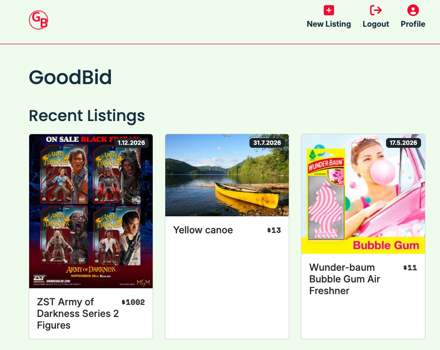

# GoodBid



A bidding platform where users can create listings, place bids on items, and manage their own auction profile.

## Description

GoodBid is a semester project created as an assignment for Front-End Development studies at Noroff.

The application is an auction platform where users can register using a Noroff email address, create listings for items they want to sell, and place bids on listings created by other users.

The platform includes:

- User registration and login
- Creating, editing, and deleting listings
- Bidding on other users’ items
- User profile page with personal listings and bids
- Listing details page with description of item, bid history and auction end date

## Built with

- HTML5
- SCSS
- JavaScript (ES Modules)
- Bootstrap 5
- Font Awesome
- Noroff API V2 – Auction House API
- Netlify

## Hosted site

[https://goodbid.netlify.app/](https://goodbid.netlify.app/)

## Getting started

### Installing

1. Clone the repository:

```bash
git clone git@github.com:VReinhaug/SemesterProject2.git
```

2. Install the dependencies:

```bash
npm install
```

### Running

To run the application locally:

```bash
npm run start
```

## Contributing

If you would like to contribute to this project, please open a pull request for review.

## Contact

[My LinkedIn profile](https://www.linkedin.com/in/veronika-reinhaug/)
